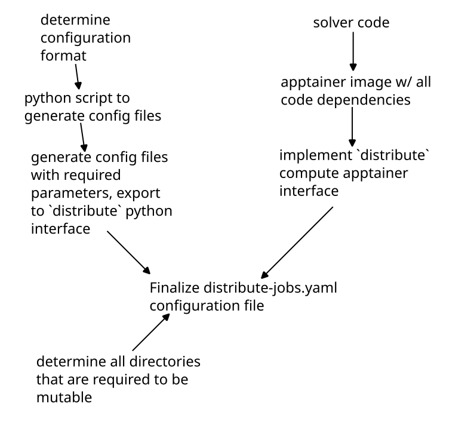

# Apptainer

Apptainer (previously named Singularity) is a container system often used for packaging HPC applications. For us,
apptainer is useful for distributing your compute jobs since you can specify the exact dependencies required
for running. If your container runs on your machine, it will run on the `distribute`d cluster!

As mentioned in the introduction, you **must ensure that your container does not write to any directories that are not bound by the host
system**. This will be discussed further below, but suffice it to say that writing to apptainer's immutable filesystem
will crash your compute job.

## Versus Docker

There is an official documentation page discussing the differences between docker
and apptainer [here](https://apptainer.org/user-docs/master/singularity_and_docker.html). There a few primary
benefits for using apptainer from an implementation standpoint in `distribute`:

1. Its easy to use GPU compute from apptainer
2. Apptainer compiles down to a single `.sif` file that can easily be sent to the `distribute` server and passed to compute nodes
3. Once your code has been packaged in apptainer, it is very easy to run it on paid HPC clusters

## Overview of Apptainer configuration files



## Apptainer definition files

This documentation is not the place to discuss the intricacies of apptainer. As a user, we have tried to make
it as easy as possible to build an image that can run on `distribute`. 
The [apptainer-common](https://github.com/Fluid-Dynamics-Group/apptainer-common) was purpose built to give you a good
starting place with compilers and runtimes (including fortran, C++, openfoam, python3). Your definition file
needs to look something like this:

```
Bootstrap: library
From: library://vanillabrooks/default/fluid-dynamics-common

%files from build
    # in here you copy files / directories from your host machine into the 
	# container so that they may be accessed and compiled. 
	# the sintax is:

	/path/to/host/file /path/to/container/file

%post
    # install any extra packages required here
	# possibly with apt, or maybe pip3

%apprun distribute
    # execute your solver here
	# this section is called from a compute node
```

A (simplified) example of a definition file I have used is this:

```
Bootstrap: library
From: library://vanillabrooks/default/fluid-dynamics-common

%files
	# copy over my files
	/home/brooks/github/hit3d/ /hit3d
	/home/brooks/github/hit3d-utils/ /hit3d-utils
	/home/brooks/github/vtk/ /vtk
	/home/brooks/github/vtk-analysis/ /vtk-analysis
	/home/brooks/github/fourier/ /fourier
	/home/brooks/github/ndarray-gradient/ /ndarray-gradient
	/home/brooks/github/matrix-notify/ /matrix-notify
	/home/brooks/github/distribute/ /distribute

%environment
	CARGO_TARGET_DIR="/target"

%post
	# add cargo to the environment
	export PATH="$PATH":"$HOME/.cargo/bin"

	cd /hit3d-utils
	cargo install --path .
	ls -al /hit3d-utils

	cd /hit3d/src
	make

	cd /vtk-analysis
	cargo install --path .

	# move the binaries we just installed to the root
	mv $HOME/.cargo/bin/hit3d-utils /hit3d/src
	mv $HOME/.cargo/bin/vtk-analysis /hit3d/src

	#
	# remove directories that just take up space
	#
	rm -rf /hit3d/.git
	rm -rf /hit3d/target/
	rm -rf /hit3d/src/output/
	rm -rf /hit3d-utils/.git
	rm -rf /hit3d-utils/target/

	#
	# simplify some directories
	#
	mv /hit3d/src/hit3d.x /hit3d.x

	# copy the binaries to the root
	mv /hit3d/src/vtk-analysis /vtk-analysis-exe
	mv /hit3d/src/hit3d-utils /hit3d-utils-exe

	mv /hit3d-utils/plots /plots

	mv /hit3d-utils/generic_run.py /run.py

%apprun distribute
	cd /
	python3 /run.py $1
```

I want to emphasize one specific thing from this file: the `%apprun distribute` section is very important. On a node 
with 16 cores, your `distribute` section gets called like this:

```
apptainer run --app distribute 16
```

In reality, this call is actually slightly more complex (see below), but this command is illustrative of the point.
**You must ensure you pass the number of allowed cores down to whatever run script you are using**. In our example:

```
%apprun distribute
	cd /
	python3 /run.py $1
```

We make sure to pass down the `16` we received with `$1` which corresponds to "the first argument that this bash script was 
called with". Similar to the python configuration, your python file is also responsible for parsing this value and running 
your solver with the appropriate number of cores. You can parse the `$1` value you pass to python using the `sys.argv` value 
in your script:

```python
import sys
allowed_processors = sys.argv[1]
allowed_processors_int = int(allowed_processors)
assert(allowed_processors_int, 16)
```

**You must ensure that you use all available cores on the machine**. If your code can only use a reduced number
of cores, make sure you specify this in your `capabilities` section! **Do not run single threaded
processes on the distributed computing network - they will not go faster**.

Full documentation on apptainer definition files can be found on the [official site](https://apptainer.org/user-docs/master/definition_files.html). 
If you are building an apptainer image based on nvidia HPC resources, your header would look something like this 
([nvidia documentation](https://catalog.ngc.nvidia.com/orgs/nvidia/containers/nvhpc)):

```
Bootstrap: docker
From: nvcr.io/nvidia/nvhpc:22.1-devel-cuda_multi-ubuntu20.05
```

## Building Apptainer Images

Compiling an apptainer definition file to a `.sif` file to run on the `distribute` compute is relatively simple (on linux). Run something like this:

```
mkdir ~/apptainer
APPTAINER_TMPDIR="~/apptainer" sudo -E apptainer build your-output-file.sif build.apptainer
```

where `your-output-file.sif` is the desired name of the `.sif` file that apptainer will spit out, and `build.apptainer` is the 
definition file you have built. The `APPTAINER_TMPDIR="~/apptainer"` portion of the command sets the `APPTAINER_TMPDIR` environment
variable to a location on disk (`~/apptainer`) because apptainer / apptainer can often require more memory to compile the `sif` file
than what is available on your computer (yes, more than your 64 GB). Since `apptainer build` requires root privileges, it must be run with `sudo`. The additional
`-E` passed to `sudo` copies the environment variables from the host shell (which is needed for `APPTAINER_TMPDIR`)

## Binding Volumes (Mutable Filesystems)

In order for your compute job to do meaningful work, you will likely save some files. But we know that 
apptainer image files are not mutable. The answer to this problem is binding volumes. A "volume" 
is container-language for a folder inside the container that actually corresponds to a folder on the 
host system. Since these special folders ("volumes") are actually part of the host computer's 
filesystem they can be written to without error. The process of mapping a folder in your container
to a folder on the host system is called "binding". 

With apptainer, the binding of volumes to a container happens at runtime. Since `distribute` wants you to have
access to a folder to save things to (in python: `./distribute_save`), as well as a folder to read the `required_files`
you specified (in python: `./distribute_save`). Apptainer makes these folders slightly easier to access by binding them
to the root directory: `/distribute_save` and `/input`. When running your apptainer on the compute node with 16
cores, the following command is used to ensure that these bindings happen:

```bash
apptainer run apptainer_file.sif --app distribute --bind \
	path/to/a/folder:/distribute_save:rw,\
	path/to/another/folder:/input:rw\
	16
```

Note that the binding arguments are simply a comma separated list in the format `folder_on_host:folder_in_container:rw`
where `rw` specifies that files in the folder are readable and writeable.
If your configuration file for apptainer looks like this:

```yaml
meta:
  batch_name: your_jobset_name
  namespace: example_namespace
  capabilities: []
apptainer:
  initialize:
    sif: execute_container.sif
    required_files:
      - path: file1.txt
      - path: file999.txt
        alias: file2.txt
    required_mounts: []
  jobs:
    - name: job_1
      required_files:
        - path: file3.txt
    - name: job_2
      required_files: []
```

When running `job_1`, the `/input` folder looks like this:

```
input
├── file1.txt
├── file2.txt
└── file3.txt
```

And when running `job_2`, the `/input` folder looks like this:

```
input
├── file1.txt
├── file2.txt
```

For a more detailed explanation of this behavior read the python configuration documentation.

Now a natural question you may have is this: If volume bindings are specified at runtime - and not
within my apptainer definition file - how can I possibly get additional mutable folders? Am I stuck
with writing to `/input` and `/distribute_save`? The answer is no! You can tell `distribute` what folders
in your container you want to be mutable with the `required_mounts` key in the `initialize` section of 
your configuration. For example, in the hit3d solver (whose definition file is used as the example
above), the following folder structure at `/` would be present at runtime:

```
.
├── distribute_save
├── hit3d-utils-exe
├── hit3d.x
├── input
├── plots
│   ├── energy_helicity.py
│   ├── proposal_plots.py
│   └── viscous_dissapation.py
└── vtk-analysis-exe
```

However, `hit3d` *requires* a folder called `output` relative to itself. Since this folder is required,
we might be (naively) tempted to simply add a call to `mkdir /output` in  our `%post` section of the 
definition file. However, we would then be creating an *immutable* directory within the image. Instead,
we simply just need to add this path to our configuration file:

```yaml
meta:
  batch_name: your_jobset_name
  namespace: example_namespace
  capabilities: []
apptainer:
  initialize:
    sif: execute_container.sif
    required_files:
      - path: file1.txt
      - path: file999.txt
        alias: file2.txt
    required_mounts:
	  - /output				# <---- here
  jobs:
    - name: job_1
      required_files:
        - path: file3.txt
    - name: job_2
      required_files: []
```

By adding this line, your container will be invoked like this (on a 16 core machine):

```
apptainer run apptainer_file.sif --app distribute --bind \
	path/to/a/folder:/distribute_save:rw,\
	path/to/another/folder:/input:rw,\
	path/to/yet/another/folder/:/output:rw\
	16
```

## Configuration File

A default configuration file can be generated with :

```
distribute template apptainer
```

```yaml
---
meta:
  batch_name: your_jobset_name
  namespace: example_namespace
  matrix: ~
  capabilities:
    - gfortran
    - python3
    - apptainer
apptainer:
  initialize:
    sif: execute_container.sif
    required_files:
      - path: /file/always/present/1.txt
        alias: optional_alias.txt
      - path: /another/file/2.json
        alias: ~
      - path: /maybe/python/utils_file.py
        alias: ~
    required_mounts:
      - /path/inside/container/to/mount
  jobs:
    - name: job_1
      required_files:
        - path: job_configuration_file.json
          alias: ~
        - path: job_configuration_file_with_alias.json
          alias: input.json
```

The `meta` section is identical to the `meta` section of python. For apptainer configurations, the only 
`capability` you need to specify is `apptainer` or `apptainer`. If you require your job to use a gpu,
you can also specify a `gpu` capability.

The `initialize` section takes in a single `.sif` file
that is built using the `apptainer build` command on a definition file, as well as some files that you always want
to be available in the `/input` directory. Then, the `required_mounts` provides a way to bind mutable directories 
to the inside of the container. Make sure that the directory you are binding to does not actually exist in the container
(but its parent directory *does* exist).

The `job` section is also very similar to the python configuration, but instead of taking python scripts *and* some files
that should be present on the system, it exclusively takes `required_files` that should be present. This is discussed
more in the next section.

## Workflow Differences From Python

The largest difference you will encounter between the apptainer and python configurations is the way in
which they are executed. While each python job has its own file that it may use for execution, the apptainer
workflow simply relies on whatever occurs in `%apprun distribute` to read files from `/input` and execute the 
binary directly. Therefore, each job in the configuration file only operates on some additional input files 
and the `.sif` file never changes. This is slightly less flexible than the python configuration (which allows
for individual python files to run each job), but by storing your input files in some intermediate structure
(like json) this difficulty can be easily overcome.

## Debugging Apptainer Jobs / Example

Because there are a lot of ways that your job might go wrong, you can use the `distribute run` command 
to run an apptainer configuration file in place. As an example, take [this test](https://github.com/Fluid-Dynamics-Group/distribute/tree/cancel-tasks/tests/apptainer_local)
that is required to compile and run in the project. The apptainer definition file is:


```
Bootstrap: library
From: ubuntu:20.04

%files
	./run.py /run.py

%post
	apt-get update -y
	apt install python3 -y

%apprun distribute
    cd /
    python3 /run.py $1
```

`run.py` is:

```python
import sys

def main():
    procs = int(sys.argv[1])
    print(f"running with {procs} processors")

    print("writing to /dir1")
    with open("/dir1/file1.txt", "w") as f:
        f.write("checking mutability of file system")

    print("writing to /dir2")
    with open("/dir2/file2.txt", "w") as f:
        f.write("checking mutability of file system")

    # read some input files from /input

    print("reading input files")
    with open("/input/input.txt", "r") as f:
        text = f.read()
        num = int(text)

    with open("/distribute_save/simulated_output.txt", "w") as f:
        square = num * num
        f.write(f"the square of the input was {square}")

if __name__ == "__main__":
    main()
```

`input_1.txt` is:

```
10
```

`input_2.txt` is:

```
15
```

and `distribute-jobs.yaml` is:


```yaml
---
meta:
  batch_name: some_batch
  namespace: some_namespace
  capabilities: []
apptainer:
  initialize:
    sif: apptainer_local.sif
    required_files: []
    required_mounts:
      - /dir1
      - /dir2
  jobs:
    - name: job_1
      required_files:
        - path: input_1.txt
          alias: input.txt
    - name: job_2
      required_files:
        - path: input_2.txt
          alias: input.txt
```

the apptainer definition file can be built with [these instructions](https://github.com/Fluid-Dynamics-Group/distribute/blob/cancel-tasks/tests/apptainer_local/build.sh).
Then, execute the job locally:

```
distribute run distribute-jobs.yaml --save-dir output --clean-save
```

The output directory structure looks like this:

```
output
├── archived_files
│   ├── job_1
│   │   ├── job_1_output.txt
│   │   └── simulated_output.txt
│   └── job_2
│       ├── job_2_output.txt
│       └── simulated_output.txt
├── _bind_path_0
│   └── file1.txt
├── _bind_path_1
│   └── file2.txt
├── distribute_save
├── initial_files
├── input
│   └── input.txt
└── apptainer_file.sif
```

This shows that we were able to write to additional folders on the host system (`_bind_path_x`), as well as read and write output files. Its worth noting that 
if this job was run on the distributed server, it would not be archived the same (`archive_files` directory is simply a way to save `distribute_save` without
deleting data). The structure on the server would look like this:

```
some_namespace
├── some_batch
    ├── job_1
    │   ├── job_1_output.txt
    │   └── simulated_output.txt
    └── job_2
        ├── job_2_output.txt
        └── simulated_output.txt
```

The outputs of the two `simulated_output.txt` files are:

```
the square of the input was 100
```

and

```
the square of the input was 225
```
