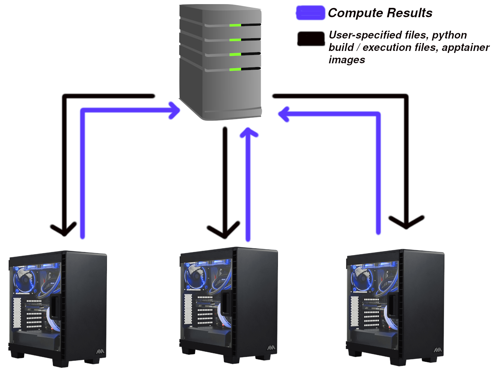

# distribute

`distribute` is a relatively simple command line utility for distributing compute jobs across the powerful
lab computers. In essence, `distribute` provides a simple way to automatically schedule dozens of jobs 
from different people across the small number of powerful computers in the lab. 

Besides having the configuration files begin easier to use, `distribute` also contains a mechanism for 
only scheduling your jobs on nodes that meet your criteria. If you require OpenFoam to run your simulation,
`distribute` automatically knows which of the three computers it can run the job on. This also allows you
to robustly choose what your requirements are for your tasks. This allows us to prioritize
use of the gpu machine to jobs requiring a gpu, increasing the overall throughput of jobs between all lab
members.

Another cool feature of `distribute` is that files that are not needed after each compute run are automatically
wiped from the hard drive, preserving limited disk space on the compute machines. Files that are specified to be 
saved (by you) are archived automatically on a 24 TB storage machine, and can be retrieved (and filtered) 
to your personal computer with a single short command.

`distribute` competes in the same space as [slurm](https://slurm.schedmd.com/overview.html), which you would
likely find on an actual compute cluster. The benefit of `distribute` is an all-in-one solution to running,
archiving, and scheduling jobs with a single streamlined utility without messing around with the complexities
of the (very detailed) slurm documentation. If you are still unconvinced, take a look at the overall architecture
diagram that slurm provides:


Since the lab computers also function as day-to-day workstations for some lab members, some additional
features are required to ensure that they are functional outside of running jobs. `distribute` solves this issue 
by allowing a user that is sitting at a computer to temporarily pause the currently executing job so that
they may perform some simple work. This allows lab members to still quickly iterate on ideas without waiting
hours for their jobs to reach the front of the queue. Since cluster computers are *never* used as 
day-to-day workstations, popular compute schedulers like slurm don't provision for this.

## Architecture

Instead of complex scheduling algorithms and job queues, we can distill the overall architecture of the 
system to a simple diagram:



In summary, there is a very simple flow of information from the server to the nodes, and from the nodes to
the server. The server is charged with sending the nodes any user-specified files (such as initial conditions,
solver input files, or csv's of information) as well as instructions on how to compile and run the project.
Once the job has finished, the user's script will move any and all files that they wish to archive to 
a special directory. All files in the special directory will be transfered to the server and saved
indefinitely. 

The archiving structure of `distribute` helps free up disk space on your laptop of workstation, and instead 
keep large files (that will surely be useful at a later date) stored away on a purpose-build machine to 
hold them. As long as your are connected to the university network - VPN or otherwise - you can access the 
files dumped by your compute job at any time.

## Specifying Jobs

We have thus far talked about all the cool things we can do with `distribute`, but none of this is free. As
a famous Italian engineer once said, "Theres no such thing as free lunch." The largest complexity with working
with `distribute` is the configuration file that specifies how to compile run project. `distribute template --python` 
will generate the following file:

```
---
initialize:
  build_file: /path/to/build.py
  required_files:
    - path: /file/always/present/1.txt
      alias: optional_alias.txt
    - path: /another/file/2.json
      alias: ~
    - path: /maybe/python/utils_file.py
      alias: ~
jobs:
  - name: job_1
    file: execute_job.py
    required_files:
      - path: job_configuration_file.json
        alias: ~
      - path: job_configuration_file_with_alias.json
        alias: input.json
```
