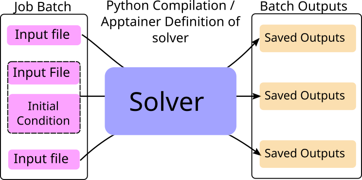

# Overview

`distribute` operates similar to a programming function. Using `apptainer` to precompile on a personal machine,
or a python script to compile on a compute node,
a solver is defined. After a solver is defined, `distribute` schedules jobs to each compute node with a compiled solver on it.
Each job contains some input files that are downloaded from the head node to compute node and placed in a predefined directory
for the solver code to access.

After execution is finished, the output files from the solver (saved in a predefined directory) are uploaded to the head node
to be downloaded by the user at a later point in time. 

In some sense, you can think of `distribute` as a function of purely the inputs: some input files are placed in a directory
as the input to the function, and your solver code ("function") places the outputs in another directory.

## Predefined Directories

There are some special directories that define where input files are placed and output files to be placed for proper archiving

|                     |Apptainer              | Python             |
|---------------------|-----------------------| -------------------|
|input file directory | /input                | /distribute_save   |
|output file directory| ./input               | ./distribute_save  |

In the case of python, you are responsible for tracking the correct paths to the input and output directories
as they are only relative locations. 

For apptainer, the input and output directories are mounted into the container from the host filesystem.
